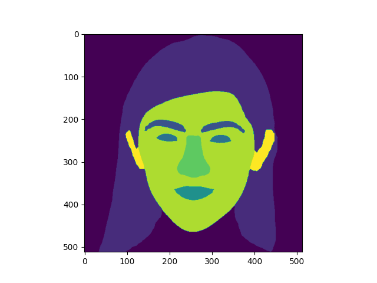

# Face Parsing Tools
### Classification List
    1.background
    2.hair
    3.brow
    4.eye
    5.lip
    6.mouth
    7.nose
    8.skin
    9.ear

### Python Version(conda install)
<hr>
```commandline
conda install -n face-parser Python==3.8.0
```

### requriements
<hr>
```commandline
colorama==0.4.6
contourpy==1.1.1
cycler==0.12.1
fonttools==4.51.0
imageio==2.34.1
kiwisolver==1.4.5
matplotlib==3.7.5
networkx==3.1
numpy==1.24.4
opencv-python==4.9.0.80
packaging==24.0
pandas==2.0.3
pillow==10.3.0
pyparsing==3.1.2
python-dateutil==2.9.0.post0
pytz==2024.1
scikit-image==0.21.0
scipy==1.10.1
six==1.16.0
tifffile==2023.7.10
torch==1.7.1+cu110
torchaudio==0.7.2
torchvision==0.8.2+cu110
tqdm==4.66.4
tzdata==2024.1
zipp==3.18.1
```

### our pretrain_model
<hr>
https://drive.google.com/file/d/16QtviOUcka3A8CMzsqIeLWhHAO5en1yT/view?usp=sharing


### install
<hr>
```commandline
pip install -r requirements.txt
```

### how to use
<hr>
The model should always be inside "pre-trained".
```commandline
from face_parsing.face_parser import 

facepaser = Parser("input_your_model_path")
parsing = facepaser.out_parsing("input_your_image_path")
plt.imshow(parsing)
plt.show()
```

### example
<hr>
```commandline
from face_parsing.face_parser import 

facepaser = Parser(osp.join("best_model","examplemodel.pth"))
parsing = facepaser.out_parsing(os.path.join("example","65.jpg"))
plt.imshow(parsing)
plt.show()
```
### result
<hr>
original file


output file



### References
<hr>
[face-parsing.PyTorch](https://github.com/zllrunning/face-parsing.PyTorch/)

[BiSeNet](https://github.com/CoinCheung/BiSeNet)
